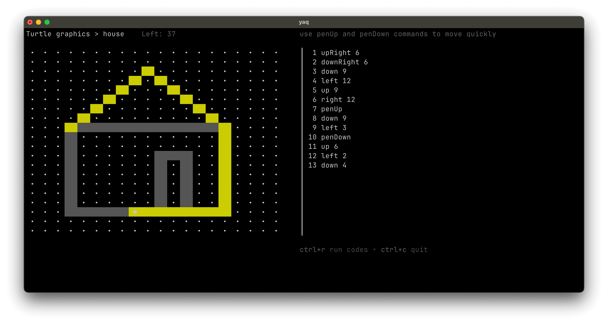
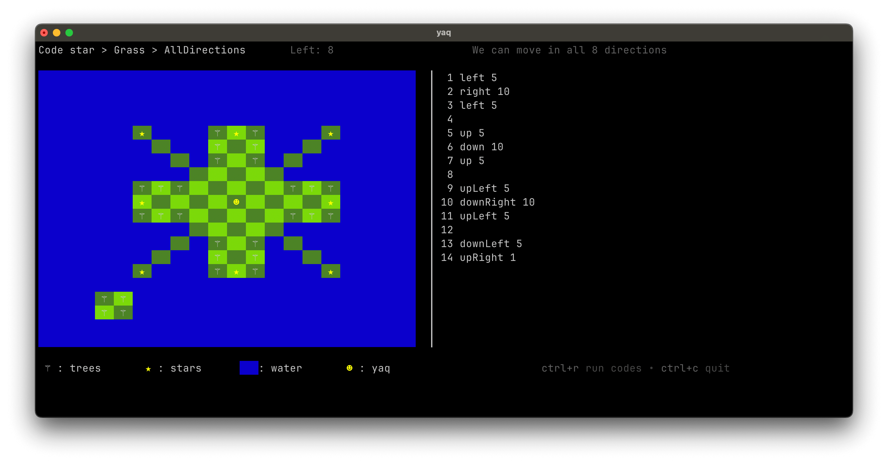
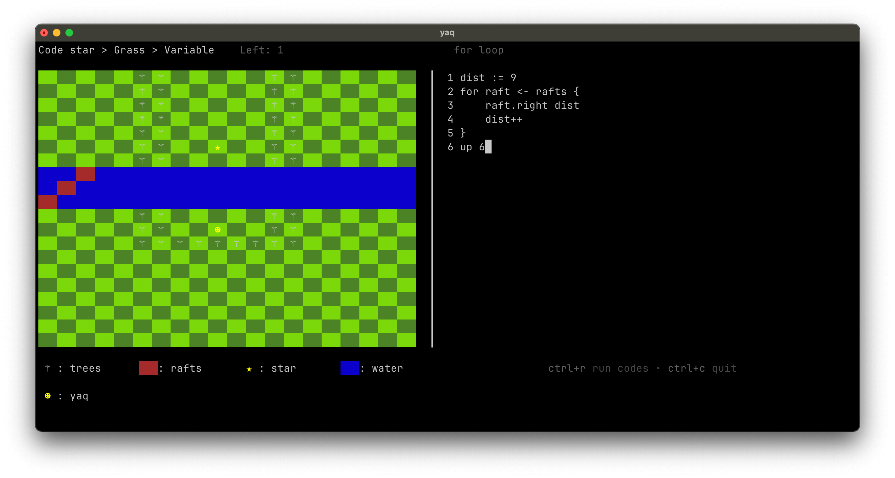
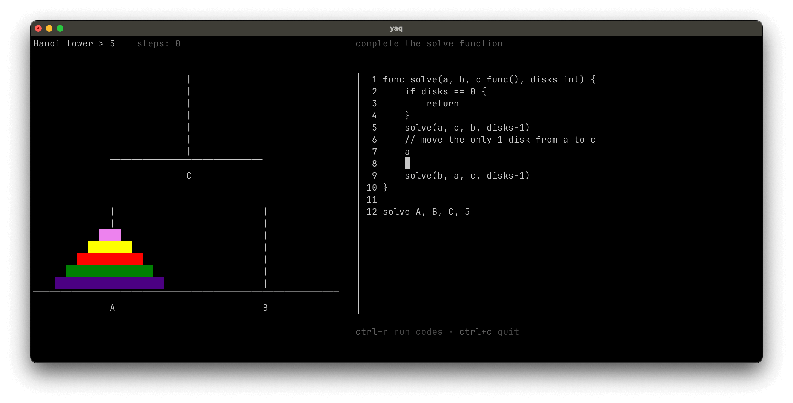

# yaq

Terminal games for learning programming, inspired by [spx](https://github.com/goplus/spx).

## Features

- Develop games with only config files
- Play games with users' inputted code
- Supports a vim like editor

## Games

### Turtle Graphics
Draw shapes and patterns by writing code commands. Perfect for learning basic programming concepts.



### Code Star
Guide a character through challenges by writing movement instructions. Learn control flow and problem-solving.




### Hanoi Tower
Solve the classic Tower of Hanoi puzzle programmatically. Master recursion and algorithmic thinking.




## Quick Start

```sh
# Install
go install github.com/zrcoder/yaq@latest

# Run
yaq
```
